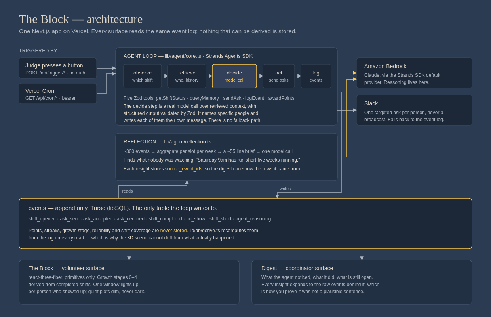

# The Block

An autonomous agent that watches food bank volunteer coverage, works out which shift is quietly failing and why, and asks specific named people to fill it.

Built for the AWS **Agents for Humans** hackathon, Good Neighbor Agents track, using the [Strands Agents TypeScript SDK](https://github.com/strands-agents/harness-sdk) on Amazon Bedrock.



## The problem

Volunteer coordinators find out a shift is short **on the day it runs**, because nothing is watching the pattern that made it predictable weeks earlier.

Scheduling is not the gap. Volgistics, VolunteerHub, Giveffect and others already do self-serve sign-up, waitlists and timed reminders. What none of them do:

- Notice that one slot has been chronically short for weeks, before it becomes a crisis
- Tell apart who *signed up* from who *actually showed up*
- Decide **who specifically** to ask for a given gap, based on history
- Notice a reliable regular who has quietly stopped coming

Best-practice guides tell coordinators to track no-show patterns by day, time and role, and to over-recruit for historically thin shifts — as a manual task somebody is supposed to remember. Nobody has time. That is the work being automated here.

An understaffed shift is not a shift that is "a bit short". A distribution planned around twelve people and run with eight is the wrong ratio of hands to food to clients. The line moves slower and less food goes out. The chain is direct: **coordination failure → understaffed shift → less food distributed.**

## Who it is for

**The volunteer coordinator.** Small-to-mid-size food pantry, often part time, often a volunteer themselves, managing 30–150 people across recurring weekly shifts. Their scarce resource is attention, not information.

**The volunteer**, secondarily — they get a message on Slack, which they already have, rather than another app to log into.

**Not** the food bank client. This product does not touch service recipients and makes no decision affecting who receives food.

## How it works

One Next.js app. Three moving parts, all reading the same event log.

**The event log is the only thing that is written.** Points, streaks, building growth stage, reliability and shift coverage are *never stored* — `lib/db/derive.ts` recomputes them from the log on every read. This is what guarantees the 3D scene cannot drift from what actually happened: if the scene shows a building, an event caused it.

**Reflection** (`lib/agent/reflection.ts`) aggregates ~300 events into a compact per-slot-per-week brief, then makes one model call over it. Raw events in, a non-obvious insight out. Every insight stores the ids of the events it came from, and the coordinator digest renders those raw rows underneath it — so an insight can be checked rather than taken on faith.

**The agent loop** (`lib/agent/core.ts`) runs observe → retrieve → decide → act → log. The decide step is a real model call with retrieved history in the prompt, using the SDK's structured output so invalid responses are re-validated automatically. It picks specific people and writes each of them their own message. There is deliberately no heuristic fallback: a ranking function standing in for the model would present asks the model never made as if it had.

The architecture — a memory stream, retrieval, and a periodic reflection pass — is adapted from Park et al., [*Generative Agents: Interactive Simulacra of Human Behavior*](https://arxiv.org/abs/2304.03442). That paper pointed it at simulated characters. This points it at real logged activity from real people.

## Running it

Requires Node.js 20+ and an AWS account with Bedrock model access.

```bash
npm install --omit=optional
cp .env.example .env.local     # then fill it in, see below
node scripts/db-push.mjs       # creates .data/local.db from lib/db/schema.sql
npm run dev
curl -X POST localhost:3000/api/dev/seed   # load the demo scenario
```

Open <http://localhost:3000>. `GET /api/health` reports which of the database, Bedrock and Slack are actually wired up.

> `--omit=optional` matters. `@strands-agents/sdk` has an optional dependency chain that reaches `node-llama-cpp` with CUDA and Vulkan binaries — hundreds of megabytes, none of it needed for Bedrock. `.npmrc` also pins `legacy-peer-deps=true` for the same reason.

### Environment

| Variable | Needed for | Notes |
|---|---|---|
| `AWS_REGION` | The agent | A region where you have Bedrock model access |
| `BEDROCK_MODEL_ID` | The agent | Optional. The SDK defaults to Claude Sonnet; set this if that model is not enabled on your account |
| `AWS_ACCESS_KEY_ID` / `AWS_SECRET_ACCESS_KEY` | The agent | Or any credential the AWS SDK chain can resolve |
| `TURSO_DATABASE_URL` | Persistence | Omit locally and it uses `file:.data/local.db` |
| `TURSO_AUTH_TOKEN` | Persistence | Only for remote Turso |
| `SLACK_BOT_TOKEN` | Notifications | Scopes `chat:write`, `users:read`. Without it, asks are written to the event log instead of sent |
| `SLACK_CHANNEL_ID` | Notifications | |
| `CRON_SECRET` | Scheduled runs | Bearer token guarding `/api/cron/*` |

### Deploying

Deploy to Vercel, set the same variables in the project, then **seed before opening the URL** — an unseeded deployment renders an empty block:

```bash
curl -X POST https://<your-deployment>/api/dev/seed -H "Authorization: Bearer $CRON_SECRET"
```

Seeding is a route rather than a script because production is Turso and Vercel gives you no shell, so the same code path has to work in both places.

## Routes

| Route | | |
|---|---|---|
| `/` | page | The Block |
| `/api/state` | GET | Derived world state for the 3D scene |
| `/api/digest` | GET | Reflections with their source events, asks sent, gaps still open |
| `/api/events` | GET | The raw event log |
| `/api/health` | GET | Which dependencies are actually configured |
| `/api/trigger/loop` | POST | Run the agent now — **unauthenticated on purpose** |
| `/api/trigger/reflect` | POST | Run reflection now. `GET` returns the aggregated brief without spending a token |
| `/api/shifts/respond` | POST | Record an acceptance, completion or no-show |
| `/api/cron/*` | GET | Scheduled equivalents, `Authorization: Bearer $CRON_SECRET` |
| `/api/dev/seed` | POST | Reseed the demo scenario. Destructive |

`/api/trigger/*` is deliberately open. The entry screen puts a "Run the agent" button in front of anyone who opens the live URL, and someone who can make the agent visibly act in one click learns more than someone reading about it. For a real deployment this would need auth and a rate limit.

## Limitations

**The data is seeded. The logic is real.** `lib/seed.ts` deterministically generates eight weeks of history for 23 volunteers, with one pattern planted in it: Saturday 9am runs 9, 9, 7 against a minimum of 6, then 5, 4, 3, 2, 3 — short five weeks running — because its two most reliable regulars stop appearing partway through. No other slot degrades: the only other shortfall anywhere in the eight weeks is Tuesday 5pm missing its minimum by one, once, in the oldest week. So identifying Saturday 9am is a real discrimination rather than the only thing available to say. The agent is not told any of this; it has to find it.

This is a prototype, and the rest of the honest list:

- No integration with a live food bank's systems
- Single tenant, no auth, no accounts
- Reflection quality depends on event volume — sparse data yields thin insights
- No handling of volunteer qualifications, waivers, or minors, all of which a real deployment would need
- Slack delivery is one-way; a volunteer replying "yes" is not parsed yet

## Repository

```
app/          routes and the two surfaces
lib/agent/    the loop, the five Zod tools, prompts, reflection
lib/db/       schema, queries, and derive.ts — events to state
lib/seed.ts   the demo scenario
components/   the react-three-fiber scene and the digest panel
docs/         prd.md, architecture.md, design.md, workflow.md, sdk-notes.md
```

`docs/` is the specification this was built against, not documentation written afterwards. `docs/sdk-notes.md` is the verified Strands SDK API surface, transcribed from the installed type definitions.

## Licence

MIT — see [LICENSE](LICENSE).
